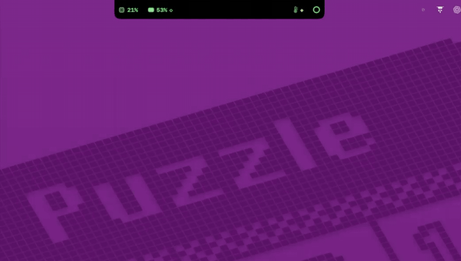

# Notch Island v0.1

맥북 노치 양옆에 상태 3칸(CPU · 메모리 압박 · 열 상태)을 띄우는 메뉴바 앱. 호버·클릭으로 펼치고, 이벤트가 나면 물방울 알림이 떨어진다.



고화질 영상: [docs/demo.mp4](docs/demo.mp4)

모드는 **매트릭스(초록 인광) 하나**, 펼침 카드는 **터미널 IDE 꼴(안 4, 폭 720pt)**: 프롬프트 줄 · 작업 줄 · cpu 점 그래프 · top 5 · cores · llm/ports · 로그 스트림 · Powerline 상태줄. 펼칠 때 코드 비 + 창틀 + 줄 타이핑(막 찍힌 글자는 0.14초 가타카나 → 진짜 글자). 접힘 줄은 시스템 아이콘(SF Symbols)+값(단계 모양)만, 펼치면 같은 자리에 상태 단어가 붙는다. Swift + SwiftUI + AppKit(NSPanel), 독 아이콘 없음(LSUIElement).

## 빌드 · 실행 · 테스트

```sh
scripts/build.sh                      # 빌드 한 줄 → build/Notch Island.app (ad-hoc 서명)
open "build/Notch Island.app"         # 실행 (종료는 메뉴바 아이콘 → 종료)
scripts/test.sh                       # 단위 테스트 (코어 + 앱 성능 회귀·카드 계약). 캡처 하네스 1개는 환경변수가 없으면 건너뜀
```

`xcode-select` 가 CLT 를 가리키는 머신이라 스크립트가 `DEVELOPER_DIR=/Applications/Xcode.app/Contents/Developer`, `arch -arm64` 를 직접 건다.
수동으로 칠 때: `env DEVELOPER_DIR=/Applications/Xcode.app/Contents/Developer arch -arm64 swift build -c release`.
프로젝트는 ~/Code 에 둘 것(~/Documents 는 TCC 차단).

## 구조

| 모듈 | 위치 | 역할 |
|---|---|---|
| 수집기(provider) | `Sources/NotchIslandCore/Providers` | 공개 API 만. 값+단위+시각+상태(확인 중/지원 안 함/실패)+원천을 공통 `Reading` 으로 |
| 이벤트 판정 | `Core/Events/EventEngine.swift` | 진입 5초·회복 15초 히스테리시스, 같은 원인 5분 억제, 우선순위·묶음. UI 독립 — 기록 재생 테스트 |
| 상태 머신 | `Core/State/IslandStateMachine.swift` | 접힘·알림·미리보기·고정·숨김. 호버 300ms · 이탈 350ms · 알림 3초. 세 모드 공통 |
| 레이아웃·입력 영역 | `Core/Layout/IslandLayout.swift` | 그려진 영역 = 입력 받는 영역. 나머지는 클릭 통과 |
| 표시 | `Sources/NotchIsland/Views` | 매트릭스 뷰 한 벌. 카드 = `CardViews.swift`(섹션) + `TermComponents.swift`(타이핑 줄·칸 막대·점 그래프·점선 링·글리치) |
| 연출 시간 | `Core/Layout/RevealTiming.swift` · `DigitScramble.swift` | 타이핑·해독·글리치 시간 계산(UI 독립, 단위 테스트) |
| 로그 스트림 | `Core/Store/StatusLog.swift` | 최근 3줄. 줄 내용은 실제 측정값·알림 문구뿐 |
| 동작 서비스 | `App/ActionService.swift` | 활성 상태 보기 열기 (다른 앱 종료 없음) |
| 비공개 센서 | `PrivateSensorProvider` 프로토콜만 | v0.1 구현 없음 (v0.2 별도 모듈) |

설정은 UserDefaults(`settingsVersion` 키 포함). 수집은 UI 밖 전용 큐에서 한 번만(접힘 2초 / 펼침 1초, 디스크 30초).

## CPU 측정 (실제 커서·키·클릭을 만들지 않는다)

```sh
scripts/measure-cpu.sh                              # 시나리오 5종, 각 30~60초 → 평균 CPU·RSS 표
scripts/measure-cpu.sh --only idle,hover-cycle --scale 0.5 --window-events --profile /tmp/prof
```

측정용 앱 인스턴스를 `--sim-pointer <idle|far-move|island-move|pinned-idle|hover-cycle>` 로 띄운다. 앱 안의 타이머가 가짜 좌표를 90Hz 로
`PanelController.evaluatePointer(at:)` 에 넣는다(전역 마우스 모니터가 부르는 것과 같은 경로). 이 모드의 인스턴스는 **실제 이벤트 모니터·메뉴바 아이콘이 없고,
패널은 투명(alpha 0)·항상 클릭 통과**라 화면에 안 보이고 사용자의 마우스도 가로채지 않는다. 별도 defaults suite 를 쓰고 측정 PID 만 종료한다.
`--window-events` 는 섬 위 좌표마다 패널 창에도 같은 mouseMoved 를 **앱 안에서** 보내 SwiftUI 이벤트 처리 비용을 근사한다(실제 입력 아님).
`--profile DIR` 은 측정 창에 `sample` 을 붙인다(이때 CPU 값은 무효).

**측정의 한계 (README 에 명시, decisions D15 참조)**: ①실제 커서가 움직일 때 WindowServer 가 앱에 이벤트를 배달하는 비용(전역 모니터 wake-up)과 AppKit 툴팁 추적은 빠진다 —
초기 실제 커서 측정(다른 입력이 섞인 값 포함)은 far-move 2.4~3.3% 였고 이 시뮬레이션은 0.5~0.7% 다 — 차이는 대부분 이 비용이다 ②CPU 시간은 한 실행에서도 0.3~1.0%(idle) 흔들린다 → 같은 조건 3회 이상, 번갈아 재서 중앙값을 본다
③충전 중이면 진행 링 TimelineView(0.5초)가 돌아 idle 이 조금 높다.
실제 커서 기준 재측정은 수동 확인 체크리스트 아래 항목으로 한다.

## 수동 확인 체크리스트 (네이티브 UI 라 빌드 성공 ≠ 렌더 정상 — 직접 봐야 하는 것)

- [ ] 접힘 줄(날개 좌우 같은 폭, 실내용 폭 ≈136pt): 왼쪽 `CPU 아이콘 9%` / 오른쪽 `메모리 아이콘 62% ◇ · 온도계 ◇ · 링`, 칸 사이 10pt, 카메라 가운데엔 아무것도 없음, 메뉴바 메뉴를 안 가림
- [ ] 펼치면 날개가 단어만큼 넓어지고 칸이 18pt 간격으로 벌어지며 `정상`·`보통`·`충전 62%` 가 페이드인(아이콘 위치 고정 규칙은 폐기), 카메라 칸 침범 없음. 고정(📌)·닫기(✕)는 카드 첫 줄 오른쪽
- [ ] 닫을 때 튕김 없음(접힘 크기 미만으로 안 줄어 하드웨어 노치가 안 보임) · 고정 중 바깥 클릭하면 닫힘(클릭은 그 앱에 그대로) · 마우스를 재빨리 빼도 닫힘
- [ ] **안 4 카드(펼침 폭 720pt)**: 펼친 직후 코드 비가 글자 **아래**에서 내리고(글자 위에 덧칠 없음) 창틀 → 줄 타이핑, 막 찍힌 글자가 잠깐 가타카나였다 굳음(약 0.85초), 끝나면 정지·정적. 카드 높이는 데이터가 와도 안 변함. 알림 문구는 0.2초 글리치 후 커서와 함께 타이핑
- [ ] 숫자(CPU %·메모리 %)가 바뀔 때 바뀐 자리만 가타카나로 섞였다 앞자리부터 숫자로 굳음, 글자가 `…` 로 잘리지 않음
- [ ] 충전 중이면 접힘 줄 링이 10칸 점선(한 칸 = 10%), 카드 작업 줄에 `[charge] ▮▮▮ 62%`. 작업이 없으면 `[idle]`
- [ ] 로그 스트림이 펼친 동안 4초에 한 줄씩 아래에서 타이핑되며 올라옴
- [ ] 진행 라벨이 길어 오른쪽이 넘치면 메모리 칸이 왼쪽 CPU 옆으로 이동(디버그 메뉴 `긴 진행 라벨`로 확인), 여유 1초 지속 시 복귀
- [ ] 단계 모양 구분: ◇ 정상 / ◈ 주의 / ◆ 높음 / ◉ 매우 높음(열) — 디버그 메뉴로 확인, 호버 툴팁에 단어
- [ ] 메뉴바 메뉴를 안 가림 (Finder·긴 메뉴 앱 — 긴 메뉴 앱은 겹칠 수 있음, 알려진 약점) · 날개 바깥 메뉴바 클릭이 정상 동작
- [ ] 호버 0.3초 → 미리보기, 이탈 0.35초 → 접힘, 클릭 → 고정, **Esc**·닫기(✕)로 접힘 (Esc 는 합성 키로만 검증됨 — 실제 키보드 확인 필요)
- [ ] 설정(메뉴바 아이콘 → 설정…)에서 호버 끄기, 알림 끄기 (모드 선택은 없음)
- [ ] 물방울 알림: 아래 "디버그 메뉴"로 메모리·열·충전기 강제 → 방울이 떨어져 알약이 됨, 3초 뒤 접힘, 호버하면 유지
- [ ] 전체화면 앱(영상·Safari 전체화면)에서 섬이 숨고 돌아오면 다시 나타남 (검증 안 됨)
- [ ] 외장 모니터 연결/해제, 덮개 닫기: 노치 화면이 없으면 섬이 숨고 메뉴바 아이콘은 남음 (검증 안 됨)
- [ ] 시스템 설정 → 손쉬운 사용 → 동작 줄이기: 움직임이 꺼지고 같은 정보가 정적으로 보임
- [ ] 잠자기 복귀 직후 네트워크 속도·CPU 에 가짜 급등이 없음 (검증 안 됨)
- [ ] 충전 중이면 오른쪽 날개의 열 칸 옆에 링+라벨이 들어가고 날개 폭은 그대로
- [ ] **실제 커서 기준 CPU 재측정**(손을 뗀 구간이 필요): 활성 상태 보기에서 Notch Island 의 CPU% 를 보면서 ①접힘·가만히 ②섬에서 먼 곳(화면 중앙)에서 30초 마우스 휘젓기 ③섬 위(접힘 줄)를 30초 쓸기 ④섬을 들어갔다 나갔다 반복(열고 닫기). 높게 나오면 `sample $(pgrep -x NotchIsland) 10` 을 떠서 상위 함수를 확인(코드 비·SwiftUI 레이아웃이면 decisions D15 의 후속 후보 참고)

## 디버그 메뉴 (알림 강제 트리거)

메뉴바 아이콘 → **디버그** →
- 메모리 압박 알림 강제 — 실제 판정 경로를 그대로 타는 "높음" 강제값 13초 (반복 억제를 비우고 시작)
- 열 상태 알림 강제 — 열 상태 "높음" 강제값 13초
- 충전기 연결 알림 강제 — 연결 전환 한 번을 엔진에 흘려 넣음
- 충전 진행 팟 표시 켜기/끄기 (가짜) — 충전 중이 아니어도 팟 자리를 확인
- 긴 진행 라벨 켜기/끄기 — 오른쪽이 넘쳐 메모리 칸이 왼쪽으로 가는지 확인

## 검증용 실행 인자 (평소엔 쓰지 않음)

실행 파일을 직접 호출: `NOTCH_ISLAND_DEFAULTS_SUITE=demo "build/Notch Island.app/Contents/MacOS/NotchIsland" --theme=cute --phase=pinned`
(`NOTCH_ISLAND_DEFAULTS_SUITE` 를 주면 실제 설정을 건드리지 않는다)
`--phase=collapsed|preview|pinned|alert-memory|alert-thermal|alert-charger` · `--demo-job` · `--demo-long-job` · `--reduce-motion` · `--open-settings` · `--quit-after=초` · `--selftest`(합성 클릭·Esc 가 SwiftUI 제스처 경로를 타는지 PASS/FAIL 출력 — 앱 안에서 창으로 직접 보내지만, 사용자가 쓰는 중인 맥에서는 돌리지 말 것) · `--sim-pointer <시나리오>`(위 "CPU 측정")

## v0.1 에 없는 것

실제 °C·팬·전력(비공개 센서), 프로세스 종료, 샌드박스/스토어 서명, 외장 모니터 가짜 알약, 로그인 시 자동 실행, 로컬 열린 포트 목록·로컬 모델 표시·GPU/전력(카드 llm·ports 칸은 `n/a (v0.2)` 자리만), 렌더·모델 로딩 진행(충전만 실데이터), 화려한·귀여운 모드(2026-10-03 삭제).

**창·입력 없는 카드 캡처**: `NOTCH_ISLAND_CAPTURE_DIR=<폴더> scripts/test.sh --filter CardCaptureHarness` — 실제 수집값으로 카드를 시각별(16ms~1050ms)로 ImageRenderer 에 그려 PNG 로 남긴다(마우스·키·창 없음).

환경변수 `NOTCH_ISLAND_TRACE=1` 이면 포인터 구역·단계 전이·섬 크기 프레임(FRAME)·날개 폭(WING)을 stdout 에 찍는다(실기 문제 추적용).
